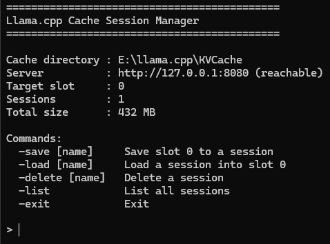

# Llama.cpp CacheManager

A small, persistent terminal program that manages llama.cpp prompt-cache
files through llama.cpp's HTTP `/slots/...` API. It stays open as an
interactive shell — it does not exit after each command — and returns
you to a home prompt until you type `-exit`.

Available for both **macOS** and **Windows**, with identical behavior on
each.

<p align="center">
	
</p>


## Prompt Caching Performance

Example benchmark with Gemma 4 12B (unsloth/gemma-4-12B-it-qat-GGUF:UD-Q4_K_XL), run with `--ctx-checkpoints 128 --swa-full`, on asking questions based on an uploaded document:

| Run | Total Prompt Tokens | Tokens Reprocessed | Prompt Eval Time | Total Request Time |
|------|--------------------:|-------------------:|-----------------:|-------------------:|
| **Without cache** | 31,526 | 31,526 (100%) | 70.78 s | 80.80 s |
| **With cache** | 31,526 | 504 (1.6%) | 2.26 s | 11.88 s |

**Result:** ~31× faster prompt evaluation and ~6.8× faster end-to-end request time.

Tested on an AMD RX 9070 XT with llama.cpp version: 0.1.0-dev (build 10424, commit 2bacf9ea5, built with Clang 20.1.8 for Windows x86_64).

## Requirements

- Python 3 installed (no additional packages required).
- Download the `llama_cache_manager.py` file. This contains the main program, and the OS-appropriate `.command` (MacOS) or `.bat` (Windows) files simply act as a double-clickable launcher.

## 1. Start llama.cpp with a slot-save path

This program does **not** start or stop llama-server. Start it yourself with
a slot-save directory, for example:

```bash
./llama-server -m your-model.gguf --slot-save-path /path/to/llama_sessions
```

Use the **same directory** for `--slot-save-path` as the cache directory
this program uses (see Configuration below) — that directory is the
authoritative storage location for saved sessions.

## 2. Run the manager


| File | Purpose |
|---|---|
| `llama_cache_manager.py` | All program logic. Pure Python 3 standard library — no installs needed. **Required on both platforms.** |
| `Llama Cache Manager.command` | Double-clickable **macOS** launcher (thin wrapper only). |
| `Llama Cache Manager.bat` | Double-clickable **Windows** launcher (thin wrapper only). |
| `config.json` | Auto-created on first run, next to the script. Edit it to change your settings. |
| `llama_sessions/` | Default cache folder, auto-created on first run. |

**You need `llama_cache_manager.py` plus the launcher for your OS, in the
same folder.** The launcher on its own does nothing — it just finds Python
and hands off to the shared script, which is why behavior is identical on
both platforms. If you already have `llama_cache_manager.py` from the
macOS download, copy that same file to your Windows machine alongside
`Llama Cache Manager.bat`; it does not need to be modified for Windows.


### macOS

Double-click **`Llama Cache Manager.command`** in Finder.

First time only: macOS may warn that the file is from an unidentified
developer. Right-click (Control-click) the file → **Open** → **Open**, or run:

```bash
xattr -d com.apple.quarantine "Llama Cache Manager.command"
```

If double-clicking does nothing (some downloads/zips strip the executable
bit), make it executable once from Terminal:

```bash
chmod +x "Llama Cache Manager.command"
```

The manager needs Python 3. If your Mac doesn't have it, the launcher will
tell you how to install it (`xcode-select --install`, or python.org).

### Windows

Double-click **`Llama Cache Manager.bat`** in File Explorer.

The manager needs Python 3. If it's not found, the launcher will tell you
to install it from python.org — make sure to check **"Add python.exe to
PATH"** during setup, since that's what lets the launcher find it. The
launcher checks for Python in this order: the `py` launcher (installed by
default by the official Windows installer), then `python`, then `python3`.

If Windows SmartScreen shows a warning ("Windows protected your PC")
because the file isn't from a recognized publisher, click **More info** →
**Run anyway**.

If double-clicking ever misbehaves, you can always run it directly from a
Command Prompt in the same folder instead:

```bat
py -3 llama_cache_manager.py
```

On Windows, `cache_dir` defaults to a `llama_sessions` folder created next
to the script (e.g. `C:\Users\you\llama-cache-manager\llama_sessions`) —
same relative-to-script convention as macOS, just with Windows path
separators.

## 3. Configuration

Three values are configurable — the server URL, the slot ID, and the cache
directory. They resolve with this precedence (highest wins):

1. **Command-line flags**: `--server`, `--slot`, `--cache-dir`
2. **Environment variables**: `LLAMA_CACHE_SERVER`, `LLAMA_CACHE_SLOT`, `LLAMA_CACHE_DIR`
3. **`config.json`** (next to the script — created automatically on first run)
4. **Built-in defaults**: `http://127.0.0.1:8080`, slot `0`, `./llama_sessions`

The simplest way to set things permanently is to edit `config.json`:

```json
{
  "server_url": "http://127.0.0.1:8080",
  "slot_id": 0,
  "cache_dir": "/path/to/llama_sessions"
}
```

**Important:** `cache_dir` here must match whatever directory you passed to
llama.cpp's `--slot-save-path`, since the manager reads/lists/deletes files
directly from that folder.

## 4. Commands

```text
-save [name]     Save slot 0 to a session
-load [name]     Load a session into slot 0
-delete [name]   Delete a session
-list            List all sessions
-exit            Exit
```

- Commands are case-insensitive (`-SAVE`, `-Save`, `-save` all work).
- Leading/trailing spaces are ignored.
- `-save`, `-load`, and `-delete` can be used with or without a name.
  Without a name, you get a numbered menu instead.
- `-save` with no sessions and no name still shows `00 - Create new session`.
- Unknown commands print a short error and return to the home prompt.

### Example session

```text
> -save Experiment_A
Saving slot 0 to 'Experiment_A'...
Slot 0 saved to Experiment_A (23 MB).

> -list
Stored sessions:

01 - Experiment_A   23 MB   2026-08-14 10:32

> -load Experiment_A
Loading 'Experiment_A' into slot 0...
Experiment_A loaded to Slot 0 (23 MB).

> -delete Experiment_A
Delete 'Experiment_A' (23 MB)? This cannot be undone. [y/N]: y
Experiment_A was deleted (23 MB).

> -exit
Exiting Llama Cache Manager. Goodbye!
```

## 5. Troubleshooting

While the wrapper itself may function without issues, llama.cpp may force prompt re-processing in certain models and system configurations. You can observer this with the following message in the logs:

```text
forcing full prompt re-processing due to lack of cache data (likely due to SWA or hybrid/recurrent memory, see https://github.com/ggml-org/llama.cpp/pull/13194#issuecomment-2868343055)
```

In some instances, this can be fixed by adding the `--swa-full` flag, and as needed, increasing the checkpoints with `--ctx-checkpoints 128`. 

## 6. Safety notes

- Session names cannot contain path separators, `..`, or control characters,
  and every resolved path is double-checked to stay inside the configured
  cache directory — so a session name can never read, write, or delete a
  file outside that folder.
- `-save` (menu, entry `00`) and direct-name `-save` on an existing session
  both ask for confirmation before overwriting.
- `-delete` always asks for confirmation before removing a file.
- `-delete` only removes the stored cache file — it never touches the
  currently loaded slot in llama.cpp, and never calls `action=erase`.
- `-exit` closes only this manager. llama.cpp keeps running.
- If the llama.cpp server is unreachable, `-save`/`-load` report a clear
  error and return you to the home prompt; `-list` keeps working since it
  only reads the local filesystem.

## 7. Non-goals (by design, for the current version)

Starting/stopping llama-server, multi-slot UI, renaming sessions,
import/export, encryption, and a GUI are intentionally out of scope.